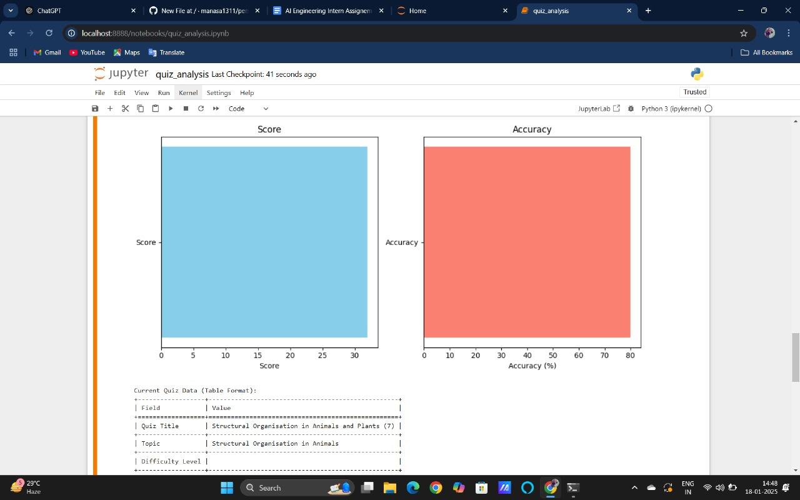

# Quiz Performance Analysis and Personalized Recommendations

## Project Overview
This project analyzes a student's quiz performance and provides personalized recommendations to help them improve their preparation. The system uses data from both the current quiz and the user's historical quiz performance to generate actionable insights and suggest focus areas.

The solution includes the following:
1. Data analysis of the current and historical quiz data.
2. Generation of performance insights (weak areas, improvement trends).
3. Personalized recommendations to improve quiz performance.

## Setup Instructions

1. **Clone the Repository**:
   First, clone this repository to your local machine using the following command:
   ```bash
   git clone https://github.com/your-username/your-repository-name.git
Install Dependencies: This project uses Python, and you need to install the necessary libraries to run the code. You can install all the dependencies listed in the requirements.txt file by running:
pip install -r requirements.txt
Run the Code: To run the code, open the quiz_analysis.ipynb file in Jupyter Notebook, and execute the cells to perform the analysis.

Project Approach
Data Sources:
Current Quiz Data: Data related to the latest quiz including topics, questions, and responses.
Historical Quiz Data: Data from the last 5 quizzes for each user, including performance metrics like score, accuracy, speed, and more.
Key Steps in the Analysis:
Exploring the Data: Understand the structure and extract relevant fields like quiz titles, topics, scores, and accuracy.
Generating Insights: Identify weak areas where the user needs improvement, such as specific topics with low accuracy or slow response times.
Providing Recommendations: Based on the analysis, generate actionable recommendations for the user to improve their quiz performance.
Student Persona: Classify the user based on their performance (e.g., needs improvement, excellent performance, etc.).
Screenshots of Key Insights
Here are the key insights and recommendations generated by the script:

##  Video Demonstration
[Watch the video here](https://www.loom.com/share/0affea2661e746ff93eb1090ef6f5c7b?sid=912c65cb-4388-497c-9f90-dad0435055e3)

Final Recommendations:
Practice more on high-difficulty questions.
Focus on topics where accuracy is low to improve your overall performance.
Enhance speed by taking timed quizzes.
Student Persona:
Needs Improvement: Focus on weak topics and practice more to boost your score.
Improvement Required: Work on improving accuracy in complex topics and improve speed through timed practice.
Dependencies:
This project requires the following libraries:

pandas
matplotlib
seaborn
requests
json
scikit-learn
These libraries can be installed via pip:
pip install pandas matplotlib seaborn requests scikit-learn
License:
This project is licensed under the MIT License - see the LICENSE file for details.

Acknowledgments:
Data from NEET Testline
Matplotlib and Seaborn for visualizations
Python Libraries: Pandas, Requests, and Scikit-learn for data analysis
